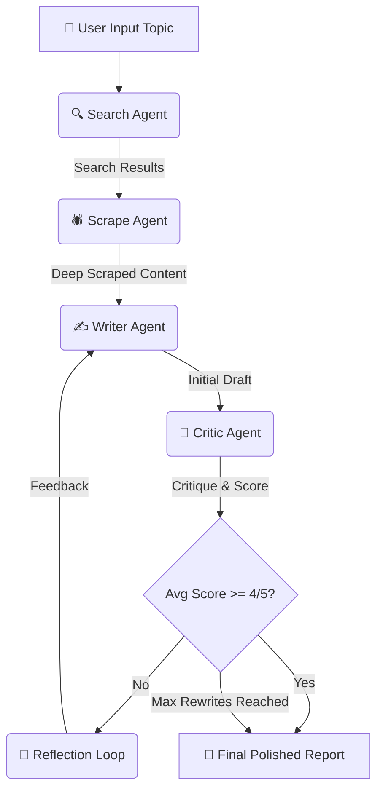

<div align="center">
  
  <h1>Research AGX 🔬</h1>
  <p><strong>An advanced, multi-agent automated research pipeline using LangChain, FastAPI, and Next.js</strong></p>
</div>

<br/>

## 🌟 Overview

**Research AGX** is an intelligent, autonomous multi-agent system designed to research any topic on the internet, analyze deep content, and write comprehensive, well-structured, and highly factual reports. It uses a **Reflection Loop**—a self-correction mechanism where the system's own output is critiqued and iteratively rewritten to meet high-quality standards.

Instead of a single language model guessing an answer, Research AGX orchestrates a team of specialized AI agents working together in a pipeline.

---

## 🤖 Multi-Agent Architecture

The system is composed of four specialized agents/chains:

1. 🔍 **Search Agent**: Queries the web for recent, reliable sources on the given topic.
2. 🕷️ **Scrape Agent**: Reads the initial search results, intelligently selects the top 3 most relevant URLs, and performs deep-scraping to extract full article text.
3. ✍️ **Writer Agent**: Synthesizes the raw scraped data into a structured research report (Introduction, Key Findings, Conclusion, and Sources).
4. 🧐 **Critic Agent**: Reviews the Writer's draft, evaluates it across four stringent criteria (Structure, Evidence, Clarity, Citation), and assigns a score out of 5.

### 🔁 The Reflection Loop
If the Critic Agent scores the report **below 4/5**, the feedback is routed back to the Writer Agent. The Writer then revises the report incorporating the critic's notes. This loop runs up to 2 times, ensuring the final output is highly polished and rigorously fact-checked.

---

## 🌊 Pipeline Flow

Below is a visual representation of how the agents interact from user input to final report generation:



---

## 🚀 Tech Stack

* **Core AI**: [LangChain](https://langchain.com/) for agent orchestration and prompt chaining.
* **LLM**: OpenAI `gpt-4o-mini`
* **Backend**: [FastAPI](https://fastapi.tiangolo.com/) with Server-Sent Events (SSE) for real-time streaming of the agent pipeline's thoughts and actions.
* **Frontend**: [Next.js](https://nextjs.org/) App Router, styled with plain CSS for a sleek, dark-mode, minimalist interface.
* **Tools**: Custom Tavily/Web Scraping integration for real-time internet access.

---

## 💻 Running the Project Locally

The project consists of a Python backend and a Node.js frontend.

### 1. Start the Backend
The backend runs on FastAPI and exposes the streaming endpoints.
```bash
# Ensure your virtual environment is active and dependencies are installed
uvicorn api:app --host 0.0.0.0 --port 8000 --reload
```

### 2. Start the Frontend
The frontend is a Next.js application.
```bash
cd frontend
npm install
npm run dev
```

The UI will be accessible at [http://localhost:3000](http://localhost:3000).

---

## 💡 Key Features

* **Real-time Pipeline UI**: Watch the agents work in real-time. The frontend expands the exact steps, search results, and scraped contents dynamically via an SSE connection.
* **Data Transparency**: Expandable accordions show you exactly what the Search and Scrape agents found before writing began.
* **Automated Self-Correction**: Eliminates hallucinations and poor formatting by utilizing a dedicated critic and iterative rewriting.
* **Markdown Support**: Reports and Critic feedback are beautifully rendered in standard markdown format.
* **One-Click Download**: Instantly export the generated research report to a `.md` file for your personal knowledge base.
